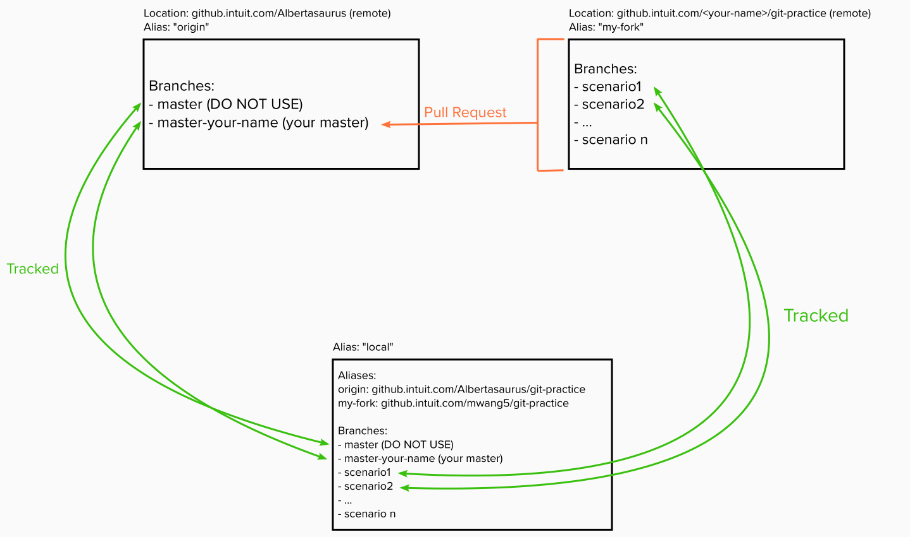

# git-practice
About this Repo:
This is a repository is a Git practice package with exercises designed to help you develop your Git skills, in the way it is most commonly used at Intuit! This repo is intended for any Intuit employee learning Git for the first time, or engineers wishing to familiarize themselves with the Git workflow at Intuit. 

The repository contains common scenarios that Intuit engineers may face. In general, scenarios are designed in ascending level of complexity. Each scenario contains a set of instructions, some StartCode an engineer will attempt to convert to the FinalCode, and the solution. 


Setup:
1. Clone "git-practice" repo on your local machine by copying the URL of the `Albertasaurus/git-practice` repo from the Github website. Specifically, copy the SSH URL from the "Clone or download" menu on the right right. 

    In your terminal, go to the folder you wish to clone this repo (we recommend in `/Users/<your-name>/dev`)
    ```console
    $ cd ~
    $ cd dev
    ```

    Use the following command to clone the repo:
    ```console
    $ git clone git@github.intuit.com:Albertasaurus/git-practice.git
    ```
    The remote located at `https://github.intuit.com/Albertasaurus/git-practice` will be referred to as "origin".
1. Fork the above repo on your account by opening the repo on Github, and clicking the "fork" button on the top right-hand corner. Observe that the URL of this remote is `github.intuit.com/<your-name>/git-practice`. 

    From now on, this fork will be referred to as `my-fork`. 
1. Configure my-fork as a remote in your local `git-practice` repo. 

    Add `my-fork` as a remote 
    ```console
    $ git remote add my-fork
    ```
    This adds "my-fork" as an alias, pointing to the remote `github.intuit.com/<your-name>/git-practice`. 
1. Create a new branch named `master-<your-name>` in your local repo by creating and checking out a new master branch
    ```console
    $ git checkout -b master-<your-name>`
    ```
    We are doing this to pretend `master-<your-name>` is real master branch. Normally, we do not have to do this, but we don't want the changes made in these exercises to affect the real master. 
1. Push `master-<your-name>` to origin
    ```console
    $ git push -u origin master-<your-name>
    ```
1. Verify that the alias `origin` points to [https://github.intuit.com/Albertasaurus/git-practice](https://github.intuit.com/Albertasaurus/git-practice) and alias `my-fork` points to [github.intuit.com/<your-name>/git-practice](github.intuit.com/<your-name>/git-practice)

    ```console
    $ git remote -v
    ```

    Your output should look something similar to: 
    ```
    my-fork	https://github.intuit.com/mwang5/git-practice?organization=mwang5 (fetch)
    my-fork	https://github.intuit.com/mwang5/git-practice?organization=mwang5 (push)
    origin	git@github.intuit.com:Albertasaurus/git-practice.git (fetch)
    origin	git@github.intuit.com:Albertasaurus/git-practice.git (push)
    ```

Diagram depicting the realtionship between `origin`, `my-fork`, and your local repositories.


[//]: # (This is the link to edit the diagram: https://app.mural.co/invitation/mural/intuitqboteam/1589302194189?sender=michellewang8970&key=961f09bb-98be-471c-90e8-6d71e6a1dab1)

Additional Notes:
* Each scenario is contained within a folder, and within each folder is a readme.md detailling all the learning goals, instructions, and solutions to each exercise. 
* origin: refers to the remote at [https://github.intuit.com/Albertasaurus/git-practice](https://github.intuit.com/Albertasaurus/git-practice)
* my-fork: refers to the remote at `https://github.intuit.com/<your-name>/git-practice`
* Any changes made directly in Github are to simulate changes made by another Intuit engineer. Normally, you do not do this. 
