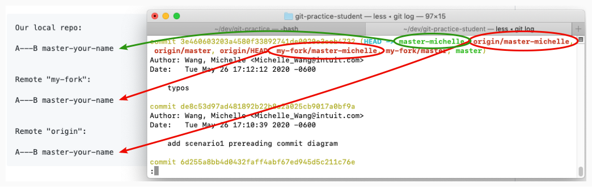
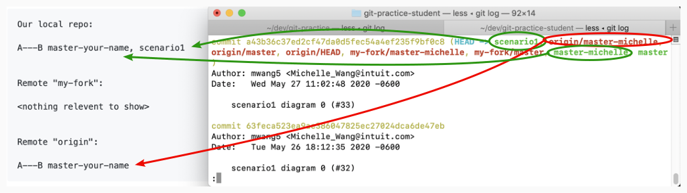
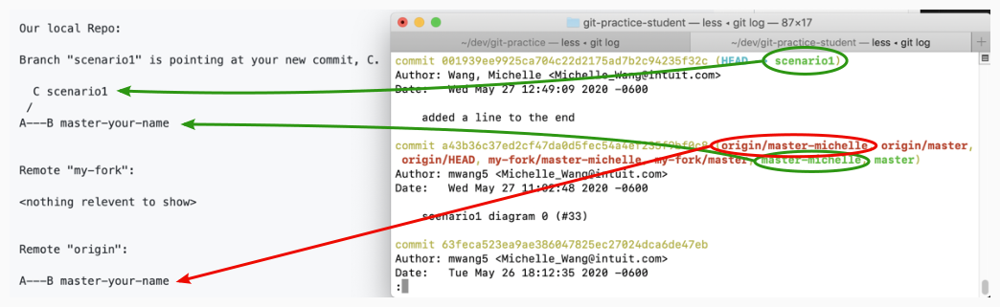
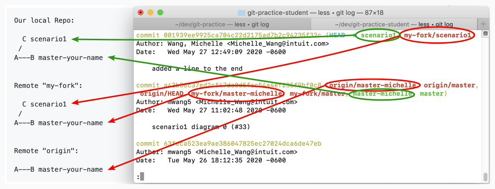
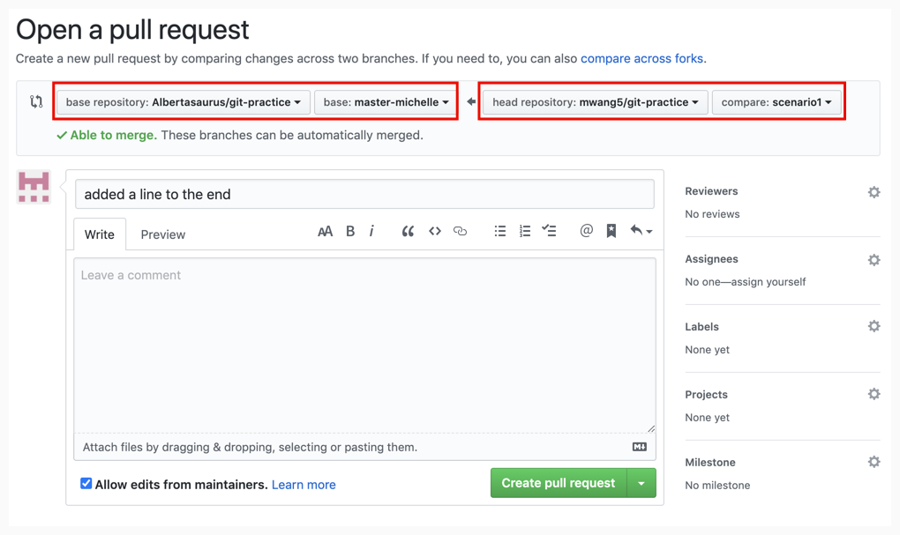
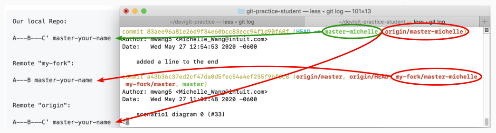

# Make changes in a feature branch and merge them to master

This exercise reflects the best-case scenario, where you (an engineer) pull code down from Git, make some changes in feature branch, and push them up to to Git, and merge with remote origin with no additional changes made by other engineers, and does not cause any merge conflicts. 

## What is a feature branch?

A [feature branch](https://bocoup.com/blog/git-workflow-walkthrough-feature-branches) is simply a separate branch in your Git repo used to implement a single feature in your project.

At Intuit, feature branches will be typically named after the JIRA ticket representing the feature or bug. For example in Payroll, a feature branch may be named `PD-123456` instead of `scenario1`.

## Commit Diagrams
The commit diagrams included in each step of the instructions should match the commit log which can be accessed in terminal with the command:
```console
$ git log
```
This command should be used after each step, to check that the pointer to every branch in the `local`, `my-fork`, and `origin` repositories match the pointers illustrated in the commit diagram. 

Here is an example of how the commit diagram and commit logs can be matched: 


    <!-- (This is the link to edit the diagram: https://app.mural.co/t/intuitqboteam/m/intuitqboteam/1590527283623/8aeb97f63a333034b7438edff848cda281bbf56c) -->

Sometimes, a certain branch will not appear in commit logs. To ensure they appear, you can add the names of those branches as arguments to the `git log` commands.
```console
$ git log scenario1 master-your-name origin/master-your-name
```

# Instructions
1. On your local machine, create a new branch called `scenario1`.
    <details>
    <summary>Solution</summary>

    ```console
    $ git checkout -b scenario1
    ```
    </details>

    <details>
    <summary>Commit Diagram</summary>

    Below are the commit diagrams for our `local repo`, remote `my-fork`, and remote `origin`. `A` and `B` represent existing commits in this project, while `C` or later letters (in future diagrams) represent new changes a user introduces. 

    It is helpful to understand the concept of "remote" and "local" repos, as well as "branching". Further explanations can be found in the main `README.md`.

    Currently, the `local repo`, `my-fork` and `origin` all point to the same commit (the existing content in the repo).
    ```
    Our local repo:
    
    A---B master-your-name, scenario1
    

    Remote "my-fork":
    
    <nothing relevent to show>
    

    Remote "origin":
    
    A---B master-your-name
    ```
    
    <!-- (This is the link to edit the diagram: https://app.mural.co/t/intuitqboteam/m/intuitqboteam/1590527283623/8aeb97f63a333034b7438edff848cda281bbf56c) -->
    </details>

1. In the `scenario1` branch, modify FileToModify.txt using a text editor of your choice so that it looks like the End Result outlined below. 
1. Stage changes (on your local machine)
    <details>
    <summary>Solution</summary>
    
    ```console 
    $ git stage -A
    ```
    </details>
1. Commit changes
    <details>
    <summary>Solution</summary>
    
    ```console 
    $ git commit -m "added a line to the end"
    ```
    </details>
    <details>
    <summary>Commit Diagram</summary>

    ```
    Our local Repo: 

    Branch "scenario1" is pointing at your new commit, C.
    
      C scenario1
     /
    A---B master-your-name
    

    Remote "my-fork": 
    
    <nothing relevent to show>
    

    Remote "origin": 
    
    A---B master-your-name
    ```
    
    <!-- (This is the link to edit the diagram: https://app.mural.co/t/intuitqboteam/m/intuitqboteam/1590528136485/f2454ae7cf47d3194fb4ecfee7cfcb939fe595f2) -->
    </details>
1. Push changes from your current local `scenario1` branch to remote `my-fork`
    <details>
    <summary>Solution</summary>
    
    ```console
    $ git push -u my-fork scenario1
    ```
    </details>
    <details>
    <summary>Commit Diagram</summary>

    Check your [`commit logs`](https://git-scm.com/book/en/v2/Git-Basics-Viewing-the-Commit-History), which contains all commits and merges by all authors in this project, in reverse-chronological order:
    ```console
    $ git log
    ```

    Try to match each pointer in the above commit logs to the commit diagrams below.

    ```
    Our local Repo: 
    
      C scenario1
     /
    A---B master-your-name
    

    Remote "my-fork": 

      C scenario1
     /
    A---B master-your-name


    Remote "origin":
    
    A---B master-your-name
    ```

    
    <!-- (This is the link to edit the diagram: https://app.mural.co/t/intuitqboteam/m/intuitqboteam/1590103154632/7b0d466ace2966b58c091eaf0aa2d6c663dedb5a) -->
    </details>
1. Open a Pull Request (PR) on the Github website to merge your changes with origin. 
    <details>
    <summary>Solution</summary>
    
    1. Go to `your-fork` (where you pushed your changes) on the Github website. By deafult, this is located at `github.intuit.com/<your-name>/git-practice`
    1. Click "New pull request" (beside "Branch: master-your-name"). Notice this action automatically takes you to the `git-practice` repo in Albertasaurus, as this is where you are trying to merge your code change to. 
    1. Scroll down to see all the file change(s) you have made, and ensure they are correct. Ensure the "head repository" is your your fork, the "base repository" is Albertasaurus/git-practice, and that the compared and base branches are both `master-your-name`.

         <!-- (This is the link to edit the diagram: https://app.mural.co/t/intuitqboteam/m/intuitqboteam/1590774642826/ba1c07bcc7ddbb787ce7e6e27de3e02ac7fd2c23) -->

    1. Click the green "Create pull request" button. Add a descriptive title and description illustrating the nature of your code change if you wish. Once all checks have passed, choose "Squash and merge" from the dropdown beside "Merge pull request", then "Confirm merge". 

        "[Squash and merge](https://github.blog/2016-04-01-squash-your-commits/#enter-commit-squashing)" takes all the commits pushed to `my-fork` and pushes them into `master-your-name` in Albertasaurus as one single commit.
    1. You can go to the "code" tab in `Albertasaurus/git-practice`, go to the `master-your-name` branch, and see that your changes are merged.

1. Check that your changes are pushed and merged correctly
    <details>
    <summary>Solution</summary>
    
    Update your local repo, and its pointers. 
    ``` console
    $ git checkout master-<your-name>
    $ git pull origin master-<your-name> 
    ```

    Check your commit logs, and ensure they match the commit diagram.
    ```console
    $ git log 
    ```
    </details>

    <details>
    <summary>Commit Diagram</summary>

    After `my-fork` is PR-ed into `master-your-name`, `master-your-name` will point at a new commit `C'`, that represents the squahsed version of all commits from the `scenario1` branch.
    ```
    Our local Repo: 
    
    A---B---C' master-your-name


    Remote "my-fork": 
    
    A---B master-your-name


    Remote "origin":
    
    A---B---C' master-your-name
    ```
     <!-- (This is the link to edit the diagram: https://app.mural.co/t/intuitqboteam/m/intuitqboteam/1590174462805/d8269296d9f97d5402299c2304a5fba7549a7a48) -->
    </details>
1. Delete branch `scenario1` by going to the `Pull requests --> Closed`, selecting your most recent PR, and clicking `delete branch`. 

# End Result
Afterwards, `FileToModify.txt` should look like the following in both origin/master-your-name:
```
Line 1 
Line 2
Line 3 - Added by you
```
