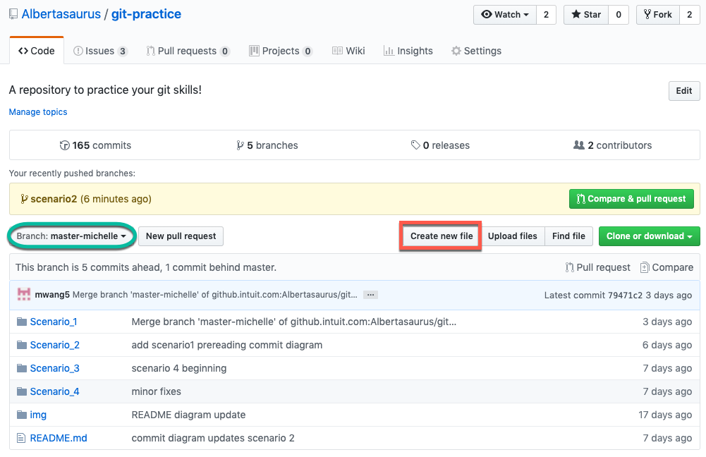
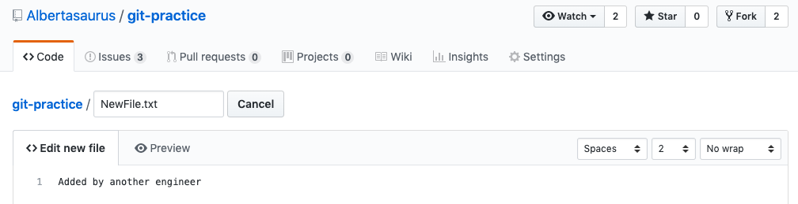

# Rebase with no merge conflicts 

This exercise reflects the scenario when other Intuit engineers have made changes to master, and you must rebase your changes on top of theirs.

You will learn how to rebase your changes on a feature branch on top of other engineers' changes in the `master-your-name` branch, assuming there are no merge conflicts. 

## What is rebasing?
[Rebase](https://www.git-tower.com/learn/git/glossary/rebase) integrates changes from one branch to another, in this case allowing the user to integrate the changes made by another engineer in the `master-your-name` branch to your feature branch. 

# Instructions
1. From your `master-your-name` branch, reset local repo to `origin/master-your-name`, so we will start this scenario in a clean state. 

    **Warning**: This is a destructive operation that will reset any work in progress. Please ensure you are ready to move on from the previous exercise. 
    <details>
    <summary>Instructions</summary>

    ```console
    $ git fetch origin
    $ git reset --hard origin/master-your-name
    ```
    </details>

    <details>
    <summary>Commit Diagram</summary>

    The local repo, `my-fork` and `origin` all point to the the existing content in the repo.

    ```
    Our local repo
    
    A---B master-your-name


    Remote my-fork:

    <nothing relevent to show>
    
    
    Remote origin:

    A---B master-your-name
    ```
    </details>
1. Create a feature branch on your local machine called `Scenario2`.
    <details>
    <summary>Solution</summary>
    
    ```console
    $ git checkout -b scenario2
    ```
    </details>

    <details>
    <summary>Commit Diagram</summary>

    ```
    Our local repo:
    
    A---B master-your-name, scenario2


    Remote my-fork:
    
    <nothing relevent to show>
    

    Remote origin:
    
    A---B master-your-name
    ```
    </details>
1. Perform your changes on the `scenario2` branch, specifically on the  `FileToModify.txt` in the `Scenario_2` folder. Stage and commit your changes. 
    <details>
    <summary>Solution</summary>
    
    1. Add a Line 3 to `FileToModify.txt`
        ```
        Line 1 
        Line 2
        Line 3 - Added by you 
        ```
    1. Stage and commit your changes 
        ```console
        $ git stage -A
        $ git commit -m "Added a new line"
        ```
    </details>

    <details>
    <summary>Commit Diagram</summary>

    ```
    Our local repo:
    
          D scenario2
         /
    A---B master-your-name
    

    Remote my-fork:
    
    <nothing relevent to show>
    

    Remote origin:
    
    A---B master-your-name
    ```
    </details>
1. In this step, we are going to act like another engineer making changes to the repo on `master-your-name`.  We'll do this by editing a file directly from the github website.  

    **Note:** Normally, one does not edit files in this fashion; it is done here to easily simulate someone else making a change.

    <details>
    <summary>Solution</summary>

    1. Navigate to [origin/scenario2](https://github.intuit.com/Albertasaurus/git-practice/tree/master/Scenario_2) 
    1. From the `branch` dropdown, choose `master-your-name`.
    1. Click the "Create new file" button 
    
    1. Name your file `NewFile.txt` and add some text (doesn't matter what).
    
    1. Click "Commit changes"
    1. On your local repo, run 
        ```console
        $ git fetch origin
        ```
        to refresh your pointers
    </details>

    <details>
    <summary>Commit Diagram</summary>
   
    The commit that contains the other engineer's changes will be represented in `C` in the following diagrams.
    
    **Note:** If `origin/master-your-name` does not appear in your `git log`, you can use the command `git log origin/master-your-name` to ensure it appears. Alternatively, this may be visualized more earily in a Git GUI such as Tower or Sourcetree. 
    ```
    Our local repo:
    
          D scenario2
         /
    A---B master-your-name
    

    Remote my-fork:
    
    <nothing relevent to show>
    

    Remote origin:

          C another-engineer
         /
    A---B master-your-name
    ```
    </details>
1. Rebase your changes on top of the new changes pulled from the remote `master-your-name`
    <details>
    <summary>Solution</summary>
    
    1. Update `master-your-name` with the latest changes from Git
        ```console
        $ git checkout master-your-name
        $ git pull origin master-your-name 
        $ git checkout scenario2
        ```
    1. Rebase your changes on top of the new changes made by another engineer in master-your-name
        ```console
        $ git rebase master-your-name
        ```
    </details>

    <details>
    <summary>Commit Diagram</summary>

    Observe that your commit, `D` is stacked on top of `C`
    ```
    Our local repo:

              D scenario 2
             /
    A---B---C another engineer 
    

    Remote my-fork:
    
    <nothing relevent to show>
    

    Remote origin:
    
          C another-engineer
         /
    A---B master-your-name
    ```
    </details>
1. Push changes to `my-fork`
    <details>
    <summary>Solution</summary>
    
    Push your changes to Github
    ```console
    $ git push -u my-fork scenario2 
    ```
    </details>
    <details>
    <summary>Commit Diagram</summary>

    ```
    Our local repo:

              D scenario 2
             /
    A---B---C another engineer 
    

    Remote my-fork:

              D scenario 2
             /
    A---B---C another engineer 
    

    Remote origin:
    
          C another-engineer
         /
    A---B master-your-name
    ```
1. Open a Pull Request (PR) to merge your changes with origin. 
    <details>
    <summary>Solution</summary>

    1. Open a Pull Request on Githunb to merge changes from `my-fork/scenario2` to `origin/master-your-name`. 
    1. Check that your commit (`D`) is on top of the other engineer's changes (`C`).
    </details>

    <details>
    <summary>Commit Diagram</summary>
    
    ```
    our local repo:
    
    A---B---C---D' master-your-name


    Remote my-fork:
    
    A---B---C---D scenario2
    
    
    Remote origin:

    A---B---C---D' master-your-name
    ```
    </details>
    
# End Result
Afterwards, the files in the Scenario_2 folder on in origin/master-your-name should look like:

* Instructions.md
* FileToModify.txt
    ```
    Line 1 
    Line 2
    Line 3 - Added by you 
    ```
* NewFile.txt
    ```
    // Whatever "another engineer" added
    ```
