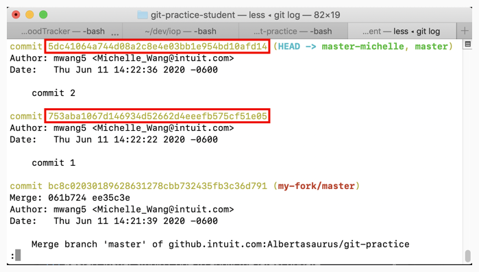

# Undo a specific commit that has been pushed into a remote repo

This exercise reflects the scenario when you and/or other engineers have made and pushed several commits into a remote repository, only for you to realize at a later time that one of your earlier commits contains an issue you must fix. 

You will first revert back to the last working version of the code, make your fix, and "cherry-pick", or "stack", the newer commits (made by you or other engineers) on top.

The same process can also be used if the the series of commits have not been pushed into the remote repo yet (they still reside on your local machine), but there are often simpler "undo" commands that can be used. 

# New Git commands in this section
* `git revert`
* `git cherry-pick`

# Instructions
1. Update/reset your repo using the [cleaning instructions](https://github.intuit.com/Albertasaurus/git-practice/blob/master/Cleaning.md) in the main folder so that your `local` and `origin` repos are pointing the the same commit.
1. Create a feature branch on your local machine called `scenario5`
    <details>
    <summary>Solution</summary>
    
    ```console
    $ git checkout -b scenario5
    ```
    </details>

    <details>
    <summary>Commit Diagram</summary>

    ```
    Our local repo:
    
    A---B master-your-name


    Remote my-fork:
    
    <nothing relevent to show>
    

    Remote origin:
    
    A---B master-your-name
    ```
    </details>

1. Make 2 **seperate** commits to `FileToModify.txt` so that your file looks like this after the first commit :
    ```
    Line 1 
    Line 2 
    commit 1

    ```
    and like this after the second commit:
    ```
    Line 1 
    Line 2 
    commit 1
    commit 2
    ```

    Stage and push these changes to `my-fork/scenario4`, and open a PR to merge these changes with `origin/master-<your-name>`.
    <details>
    <summary>Solution</summary>
    
    1. Add a line to `FileToModify.txt` so that it looks like (make sure you hit "Enter" after typing "commit 1" so that merge conflicts are minimized): 
    ```
    Line 1 
    Line 2 
    commit 1

    ```
    1. Stage and commit your changes 
    ```console
    $ git stage -A
    $ git commit -m "commit 1"
    ```

    1. Add another line to `FileToModify.txt` so that it now looks like:
    ```
    Line 1 
    Line 2 
    commit 1
    commit 2
    ```

    1. Stage and commit your changes 
    ```console
    $ git stage -A
    $ git commit -m "commit 2"
    ```
    1. Push your changes
    ```console
    $ git push -u my-fork scenario5
    ```
    1. Open a PR on Github and merge your changes from `my-fork/scenario5` to `origin/master-<your-name>`.
    </details>

    <details>
    <summary>Commit Diagram</summary>

    ```
    Our local repo:

            D scenario5 (commit 2)
           /
          C scenario5 (commit 1)
         / 
    A---B master-your-name


    Remote my-fork:

            D scenario5 (commit 2)
           /
          C scenario5 (commit 1)
         / 
    A---B master-your-name
    

    Remote origin:
    
            D' scenario5 (commit 2)
           /
          C scenario5 (commit 1)
         / 
    A---B master-your-name
    ```
    </details>
1. Suppose you realize you made a mistake in your first commit, and you actually meant to write `commit 1 - correct commit` in `FileToModify.txt`. Revert back to pre-commit 1 state. 
    <details>
    <summary>Solution</summary>
    
    1. Ensure there are no changes in the working directory by either commiting them with `git commit`, or discarding them with `git clean -df`. 
    1. Open the commit log with `git log`, and copy down all the commit hashes up to the one you want to revert to. In this case, copy the commit hashes of commit 1 and commit 2. 
        ```console
        $ git log
        ```
        
        <!-- (This is the link to edit the diagram: https://app.mural.co/t/intuitqboteam/m/intuitqboteam/1591907312923/0e1cfb9bc6e420aacae3f076f3690015aec88c45) -->
    1. Revert to commit 1
        ```console
        $ git revert <commit hash of commit 1>
        ```
        1. Resolve merge conflicts if necessary
        1. Add changes with `git add -A`, and continue revert with `git revert --continue`. 
        1. If necessary, type `:q` then press `enter` in your terminal to exit the confirmation message. 
    1. Run `git log`, and observe there is a new commit which is a "Revert "commit 1"". The hash number of the commit was reverted is provided in the commit description.

        Notice that the existing commit 2 and commit 1 are still in the commit stack, but a new commit which "reverted" commit 1 is on top. 
    </details>

    <details>
    <summary>Commit Diagram</summary>

    ```
    Our local repo:

              E scenario5 (Reverted commit 1)
             /
            D scenario5 (commit 2)
           /
          C scenario5 (commit 1)
         / 
    A---B master-your-name


    Remote my-fork:

    A---B---C---D scenario5 (commit 2)
    

    Remote origin:
    
    A---B---C---D' scenario5 (commit 2)
    ```
    </details>
1. Fix commit 1 by changing line 3 to the correct line "commit 1 - correct commit" in `FileToModify.txt`. Stage and commit these changes.
    <details>
    <summary>Solution</summary>
    
    1. Edit your `FileToModify.txt` so that it is now correct:
        ```
        Line 1 
        Line 2 
        commit 1 - correct commit 
        ```
    1. Stage and commit your changes
        ```console
        $ git stage -A
        $ git commit -m "commit 1 - correct commit"
        ```
    </details>

    <details>
    <summary>Commit Diagram</summary>

    ```
    Our local repo:

                F scenario5 (commit 1 - correct commit)
               /
              E scenario5 (Reverted commit 1)
             /
            D scenario5 (commit 2)
           /
          C scenario5 (commit 1)
         / 
    A---B master-your-name


    Remote my-fork:

    A---B---C---D scenario5 (commit 2)
    

    Remote origin:
    
    A---B---C---D' scenario5 (commit 2)
    ```
    </details>
1. Put your commit 2 on top of your corrected commit 1 by cherry-picking commit 2. 
    <details>
    <summary>Solution</summary>
    
    1. Use the (git cherry-pick)[https://www.atlassian.com/git/tutorials/cherry-pick] command to pick out any commits (in this case commit 2) that came after commit 1, and stack them on top of the correct commit 1. 
        ```console
        git cherry-pick <commit hash of commit 2>
        ```
    1. Resolve merge conflicts if any appear. Your `FileToModify.txt` should now look like: 
        ```
        Line 1 
        Line 2 
        commit 1 - correct commit 
        commit 2
        ```
        1. If you had to resolve merge conflicts, stage your changes and continue with cherry-picking.
            ```console
            $ git stage -A
            $ git cherry-pick --continue
            ```
        1. If necessary, type `:q` then press enter in your terminal to exit the confirmation message. 
    1. Run `git log`, and observe that the order of commits matches the commit diagram. 
    </details>

    <details>
    <summary>Commit Diagram</summary>

    ```
    Our local repo:

                  G' scenario5 (commit 2 (cherry-picked))
                 /
                F scenario5 (commit 1 - correct commit)
               /
              E scenario5 (Reverted commit 1)
             /
            D scenario5 (commit 2)
           /
          C scenario5 (commit 1)
         / 
    A---B master-your-name


    Remote my-fork:

    A---B---C---D scenario5 (commit 2)
    

    Remote origin:
    
    A---B---C---D' scenario5 (commit 2)
    ```
    </details>
1. Push your changes to `my-fork/scenario5`, then open a PR to merge these changes with `origin/master-<your-name>`. 
    <details>
    <summary>Solution</summary>

    1. Push your changes to `my-fork/scenario5`
        ```console
        $ git push my-fork scenario5
        ```
    1. Open a Pull Request on Githunb to merge changes from `my-fork/scenario5` to `origin/master-<your-name>`. 
    1. Run `git fetch origin` to refresh your local repo's pointers  
    1. Using `git log` or a Git GUI, check that the commits are in the right order. 
    </details>

    <details>
    <summary>Commit Diagram</summary>

    ```
    Our local repo:

                  G' scenario5 (commit 2 (cherry-picked))
                 /
                F scenario5 (commit 1 - correct commit)
               /
              E scenario5 (Reverted commit 1)
             /
            D scenario5 (commit 2)
           /
          C scenario5 (commit 1)
         / 
    A---B master-your-name


    Remote my-fork:

                  G' scenario5 (commit 2 (cherry-picked))
                 /
                F scenario5 (commit 1 - correct commit)
               /
              E scenario5 (Reverted commit 1)
             /
            D scenario5 (commit 2)
           /
          C scenario5 (commit 1)
         / 
    A---B master-your-name
    

    Remote origin:
    
                  G'' scenario5 (commit 2 (cherry-picked))
                 /
                F scenario5 (commit 1 - correct commit)
               /
              E scenario5 (Reverted commit 1)
             /
            D scenario5 (commit 2)
           /
          C scenario5 (commit 1)
         / 
    A---B master-your-name
    ```

# End Result
Afterwards, `FileToModify.txt` should look like the following in `originmaster-<your-name>`:
```
Line 1
Line 2
commit 1 - correct commit
commit 2 
```