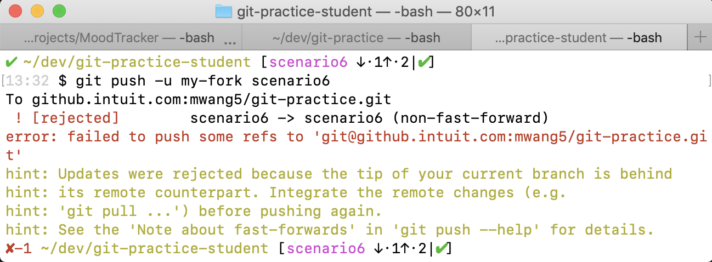

# Rebase requiring force push 

This exercise reflects the scenario where you must rebase updates in your feature branch that have already been pushed to your fork, on top of changes other Intuit engineers made master. However, you must use a `Force push` to rewrite commit history. 

## What is "[Force pushing](https://www.atlassian.com/git/tutorials/syncing/git-push)"?

Normally, `git push` exports local commits to a remote repository by "fast forwarding" the commit history in the remote (Git simply stacks all your new commits on top of the existing ones in a linear fashion). 

Git will not allow you to push when it results in a non-fast-forward merge in the destination repo. This is often the case when we use commands that re-write the commit history like `git rebase`, resulting in divergent commit histories between the local and remote repos. 

If this is the git log before new changes are pushed:
```
A---B Existing cotent 
```
This is allowed after a push:
```
      C---D New content (fast-forwarded)
     /
A---B Existing content 
```

This is not allowed:
```
      B---D New content (not fast-forwarded)
     /
A---C Existing content 
```

The `--force` flag in git push <remote> --force is a very dangerous, yet powerful tool that allows you to push changes to a remote repo even when it results in a non-fast-foward merge (the second case). It should not be used unless you're **ABSOLUTELY CERTAIN** what you're doing. `git push --force` overwrites the existing content and commit history with the content and history you're pushing (see above). 

# New Git commands in this section
* `git push --force`

# Instructions
1. Update/reset your repo using the [cleaning instructions](https://github.intuit.com/Albertasaurus/git-practice/blob/master/Cleaning.md) in the main folder so that your `local` and `origin` repos are pointing the the same commit.
1. Create a feature branch on your local machine called `scenario6`.
    <details>
    <summary>Solution</summary>

    ```console
    $ git checkout -b scenario6
    ```
    </details>

    <details>
    <summary>Commit Diagram</summary>

    ```
    Our local repo:
    
    A---B master-your-name


    Remote my-fork:
    
    <nothing relevent to show>
    

    Remote origin:
    
    A---B master-your-name
    ```
    </details>
1. Add a line to `FileToModify.txt` in the Scenario_6 folder, and push your changes to `my-fork/scenario6`.
    <details>
    <summary>Solution</summary>

    1. Add a line to `FileToModify.txt` so that it looks like:
        ```
        Line 1 - Local changes 

        ```
        Be sure to press "Enter" after your change to minimize merge conflicts later on.
    1. Stage, commit, and push your changes to `my-fork/scenario6`
        ```console
        $ git stage -A
        $ git commit -m "Local changes"
        $ git push -u my-fork scenario6
        ```
    </details>

    <details>
    <summary>Commit Diagram</summary>

    ```
    Our local repo:
    
    A---B---C scenario 6 (Local changes)


    Remote my-fork:
    
    A---B---C scenario 6 (Local changes)
    

    Remote origin:
    
    A---B master-your-name
    ```
    </details>
1. Simulate changes made by another engineer by going to Github, and adding `Line 2 - Added by another engineer` in the same `FileToModify.txt` file in the Scenario_6 folder, on the `master-<your-name>` branch in `origin`.
    <details>
    <summary>Solution</summary>

    1. Navigate to the [Scenario_6](https://github.intuit.com/Albertasaurus/git-practice/tree/master/Scenario_6) folder in `origin`. 
    1. From the `branch` dropdown, choose `master-<your-name>`.
    1. Open `FileToModify.txt`, and change the line `Line 3B - Added by you` to `Line 2 - Added by another engineer` so that the file looks like:
        ```
        Line 2 - Added by another engineer 
        ```
    1. Add the commit message `Added by another engineer`, and click "Commit changes".
    </details>

    <details>
    <summary>Commit Diagram</summary>

    Recall: changes in remote repos will not be reflected in local commit logs unless you run `git fetch`
    ```
    Our local repo:
    
    A---B---C scenario 6 (Local changes)


    Remote my-fork:
    
    A---B---C scenario 6 (Local changes)
    

    Remote origin:
    
    A---B---D Added by another engineer 
    ```
    </details>

1. Rebase your changes in the `scenario6` branch on top of the new changes pulled from the remote `origin/master-<your-name>`. Resolve merge conflicts if there are any. 
    <details>
    <summary>Solution</summary>

    1. Update your local `master-<your-name>` branch with the latest changes from Git
        ```console
        $ git checkout master-your-name
        $ git pull origin master-your-name 
        $ git checkout scenario6
        ```
    1. Rebase your changes on top of the new changes made by another engineer in `master-<your-name>`. 
        ```console
        $ git rebase master-your-name
        ```
    1. Resolve merge conflicts if they arise so that your final `FileToModify.txt` looks like:
        ```
        Line 1 - Local changes
        Line 2 - Added by another engineer 
        ```
        Add your changes, and finish the rebase.

        If you forget how to do so, please refer to Step 6 in [scenario 3](https://github.intuit.com/Albertasaurus/git-practice/tree/master/Scenario_3/#Instructions). 

    1. Check your rebased changes are in the expected order
        ```console
        $ git log
        ```
    </details>

    <details>
    <summary>Commit Diagram</summary>

    ```
    Our local repo:
    
              C' scenario 6 (Local changes)
             /
    A---B---D scenario6 (Added by another engineer)


    Remote my-fork:
    
    A---B---C scenario 6 (Local changes)
    

    Remote origin:
    
    A---B---D Added by another engineer
    ```
    </details>

1. Push your changes to remote `my-fork/scenario6`
    <details>
    <summary>Solution</summary>

    1. Attempt to push local changes remote `my-fork/scenario6`
        ```console
        $ git push -u my-fork scenario6 
        ```
        It should result in an error:
        
        The push is rejected by Git because it results in a non-fast-forward merge in the destination repo. 
    1. Double check that the changes you want to push in `FileToModify.txt` are correct, and that you are not pushing any additional changes. Once you are **ABSOLUTELY SURE** it is safe to push our code up to our remote `my-fork` repo even if it overrwrites the existing content, force push your changes to remote my-fork. 

        ```console
        $ git push -u --force my-fork scenario6
        ```
    1. Using `git log` or a Git GUI, check that the commits are in the right order. 
    </details>

    <details>
    <summary>Commit Diagram</summary>

    ```
    Our local repo:
    
              C' scenario 6 (Local changes)
             /
    A---B---D scenario6 (Added by another engineer)


    Remote my-fork:
    
              C' scenario 6 (Local changes)
             /
    A---B---D scenario6 (Added by another engineer)
    

    Remote origin:
    
    A---B---D Added by another engineer 
    ```
    </details>
1. Open a Pull Request (PR) on Github to merge changes from `my-fork/scenario6` to `origin/master-<your-name>`.
    <details>
    <summary>Solution</summary>

    If you forget how to do so, please refer to Step 10 in [scenario 4](https://github.intuit.com/Albertasaurus/git-practice/tree/master/Scenario_4/#Instructions).  
    </details>

    <details>
    <summary>Commit Diagram</summary>

    ```
    Our local repo:
    
              C' scenario 6 (Local changes)
             /
    A---B---D scenario6 (Added by another engineer)


    Remote my-fork:
    
              C' scenario 6 (Local changes)
             /
    A---B---D scenario6 (Added by another engineer)
    

    Remote origin:
    
              C'' Local changes 
             /
    A---B---D Added by another engineer 
    ```
    </details>

# End Result
Afterwards, `FileToModify.txt` should look like the following in `originmaster-<your-name>`:
```
Line 1 - Local changes
Line 2 - Added by another engineer 
```