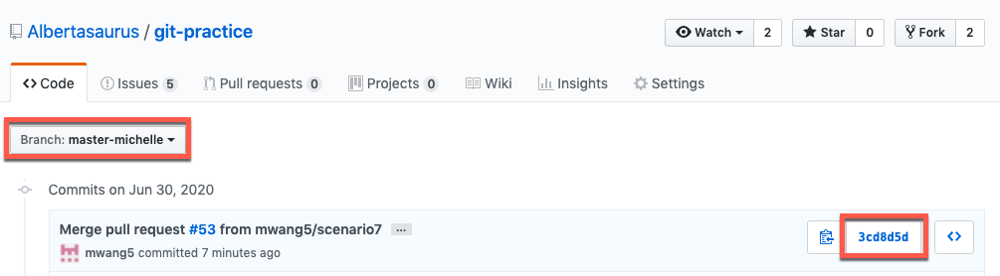
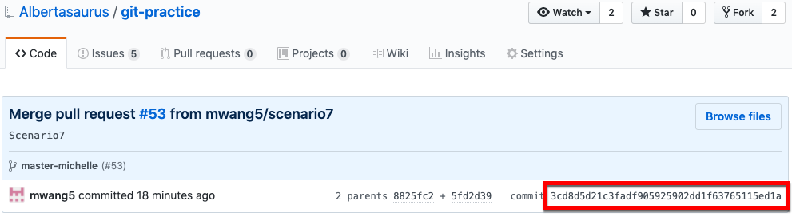

# Undo a commit that has been merged with its parent branch

This scenario reflects the scenario when you wish you undo a commit that has merged a feature branch with its parent branch. Perhaps you made a mistake in your feature branch, and you wish to correct it before merging it with its parent. 

You will first "un-merge" the commit by reverting back to the last commit before the merge, make your adjustments, re-commit, and push your changes. 

# New Git commands in this section
* `git revert -m 1`
* `git revert -m 2`

# Instructions
1. [Reset your repo](https://github.intuit.com/Albertasaurus/git-practice/blob/master/Cleaning.md) to a clean state
1. Create a feature branch on your local machine called `scenario7`.
    <details>
    <summary>Solution</summary>

    ```console
    $ git checkout -b scenario7
    ```
    </details>

    <details>
    <summary>Commit Diagram</summary>

    ```
    Our local repo:
    
          C scenario7
         /
    A---B master-your-name


    Remote my-fork:
    
    <nothing relevent to show>
    

    Remote origin:
    
    A---B master-your-name
    ```
    </details>
1. Add a line to `FileToModify.txt` in the Scenario_7 folder, and push your changes to `my-fork/scenario7`. Then, open a PR and merge these changes with `origin/<master-your-name>`.
    <details>
    <summary>Solution</summary>

    1. Add a line to `FileToModify.txt` so that it looks like:
        ```
        Line 1 
        Line 2
        Line 3 - change #1 
        ```
    1. Stage, commit, and push your changes to `my-fork/scenario7`
        ```console
        $ git stage -A
        $ git commit -m "change #1"
        $ git push -u my-fork scenario7
        ```
    1. Open a Pull Request (PR) on Github to merge changes from `my-fork/scenario7` to `origin/master-<your-name>`.
    </details>

    <details>
    <summary>Commit Diagram</summary>

    ```
    Our local repo:
    
    A---B---C scenario 7 (change #1)


    Remote my-fork:
    
    A---B---C scenario 7 (change #1)
    

    Remote origin:
    
    A---B---C' scenario 7 (change #1)
    ```
    </details>
1. Suppose you realize you made a mistake, and you need to un-merge your PR, correct your mistake, and re-merge it. First, obtain the commit hash of the commit hash of the merge commit in `origin/master-<your-name>`. 
    <details>
    <summary>Solution</summary>

    1. View the commit history on your `master-<your-name>` branch in the [Albertasaurus repo](https://github.intuit.com/Albertasaurus/git-practice/commits/master) by navigating to the Albertasaurus repo on Github, and choosing the `master-<your-name>` branch from the "Branch" dropdown.
    1. From the list of commits, locate the commit that merged your PR from `my-fork/scenario7` to `origin/master-<your-name>`, and click on the commit hash (on the right hand side).
    
    1. Copy the full commit hash of the merge commit 
    
    </details>
1. Revert to the last commit before the merge 
    <details>
    <summary>Solution</summary>

    1. Run `git fetch origin` to refresh your local repo's pointers, so that your local repo "knows" about the merge that took place on the Github webiste. 
    1. Revert the merge commit
        ```console
        $ git revert -m 1 <commit hash of merge commit>
        ```

       We use the `-m 1` flag to tell that this is a merge, and we want to rollback to the state of the parent commit on the `master-<your-name>` branch. 

       In other circumstances, the `-m 2` flag can be used to rollback to the state of the parent commit on the feature branch.
    1. If necessary, type `:q` then press `enter` in your terminal to exit the confirmation message. 
    </details>

    <details>
    <summary>Commit Diagram</summary>

    ```
    Our local repo:
    
    A---B---C---D scenario 7 (revert change #1)


    Remote my-fork:
    
    A---B---C scenario 7 (change #1)
    

    Remote origin:
    
    A---B---C' scenario 7 (change #1)
    ```
    </details>

1. "Correct" your mistake by adding another line to the end of `FileToModify.txt`
    <details>
    <summary>Solution</summary>

    1. Add the "corrected" changes to `FileToModify.txt` so that it looks like:
        ```
        Line 1 
        Line 2
        Line 3 - change #1 
        Line 4 - corrected chnages 
        ```
    1. Stage and commit your changes
        ```console
        $ git stage -A
        $ git commit -m "corrected changes"
        ```
    </details>

    <details>
    <summary>Commit Diagram</summary>

    ```
    Our local repo:
    
    A---B---C---D---E scenario 7 (corrected changes)


    Remote my-fork:
    
    A---B---C scenario 7 (change #1)
    

    Remote origin:
    
    A---B---C' scenario 7 (change #1)
    ```
    </details>

1. Push your changes to `my-fork/scenario7`, and open a Pull Request (PR) on Github to merge corrected changes from `my-fork/scenario7` to `origin/master-<your-name>`.
    <details>
    <summary>Solution</summary>

    1. Push your changes 
        ```console
        $ git push -u my-fork scenario7
        ```
    1. Open a Pull Request (PR) on Github to merge changes from `my-fork/scenario7` to `origin/master-<your-name>`.
    </details>

    <details>
    <summary>Commit Diagram</summary>

    ```
    Our local repo:
    
    A---B---C---D---E scenario 7 (corrected changes)


    Remote my-fork:
    
    A---B---C---D---E scenario 7 (corrected changes)
    

    Remote origin:
    
    A---B---C'---D---E' scenario 7 (corrected changes)
    ```
    </details>    

1. git fetch origin
1. git revert -m 1 <commit hash of merge commit in origin> (:q to quit if necessary)
1. (add correct changes)
1. git push -u my-fork scenario7
1. PR to origin/master-michelle

# End Result
Afterwards, `FileToModify.txt` should look like the following in `origin/master-<your-name>`:
```
Line 1 
Line 2
Line 3 - change #1 
Line 4 - corrected chnages 
```